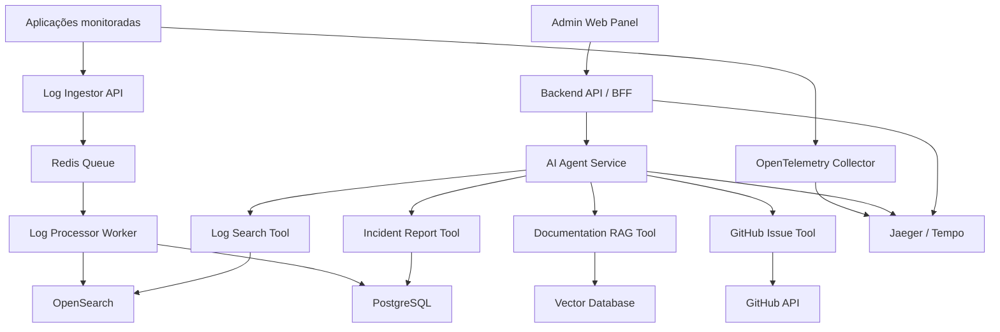

# AI Log Debug Agent

## 1. Resumo do projeto

O **AI Log Debug Agent** é uma plataforma para auxiliar desenvolvedores e times de suporte/infra a investigar erros de produção usando um agente de IA conectado a logs, traces, documentação técnica e histórico de incidentes.

A ideia central é permitir que um usuário acesse um **painel administrativo** e converse com um agente de IA em linguagem natural, fazendo perguntas como:

* “Busque os erros 500 da última hora no serviço de pagamentos.”
* “Qual foi a causa mais provável desse stack trace?”
* “Agrupe erros parecidos que aconteceram hoje.”
* “Me mostre os logs relacionados ao request ID `abc-123`.”
* “Gere um resumo técnico para eu abrir uma issue no GitHub.”

O agente não apenas responde com texto. Ele utiliza ferramentas internas para consultar logs, buscar contexto em documentação, correlacionar eventos, identificar padrões e sugerir próximos passos de investigação.

---

## 2. Objetivo do projeto

Criar uma aplicação full stack com agentes de IA capaz de:

1. Receber logs de aplicações backend.
2. Armazenar e indexar logs para busca eficiente.
3. Permitir consultas em linguagem natural sobre logs e erros.
4. Usar um agente de IA para transformar perguntas em buscas estruturadas.
5. Correlacionar logs, stack traces, traces distribuídos e documentação técnica.
6. Exibir respostas explicáveis no painel administrativo.
7. Gerar relatórios técnicos, sugestões de causa raiz e próximos passos.

O projeto será construído com foco em demonstrar habilidades reais de backend, arquitetura distribuída, observabilidade, IA aplicada, RAG, filas, Docker e integração entre serviços.

---

## 3. Proposta de arquitetura

A arquitetura será baseada em serviços independentes, com separação entre ingestão de logs, armazenamento, busca, agente de IA e painel administrativo.



---

## 4. Serviços que serão criados

### 4.1 Admin Web Panel

**Responsabilidade:** interface administrativa para o usuário conversar com o agente de IA, visualizar logs, acompanhar investigações e consultar relatórios.

**Tecnologias:**

* TypeScript
* React
* Vite
* Tailwind CSS
* shadcn/ui
* TanStack Query
* React Router

**Funcionalidades:**

* Login de usuário.
* Chat com o agente de IA.
* Tela de histórico de conversas.
* Visualização de logs retornados pelo agente.
* Filtros por serviço, ambiente, nível de log e período.
* Tela de incidentes gerados.
* Tela de detalhes de uma investigação.
* Botão para gerar issue no GitHub.

---

### 4.2 Backend API / BFF

**Responsabilidade:** servir como camada intermediária entre o painel administrativo, banco de dados, autenticação e serviço de IA.

**Tecnologias:**

* TypeScript
* NestJS
* PostgreSQL
* Prisma ORM
* Redis
* JWT/Auth.js ou integração OAuth futura

**Funcionalidades:**

* Autenticação e autorização.
* Gerenciamento de usuários.
* Controle de permissões.
* Persistência de conversas com o agente.
* Persistência de incidentes e relatórios.
* API para consulta de logs salvos.
* Proxy seguro para o AI Agent Service.
* Auditoria de ações executadas pelo agente.

---

### 4.3 Log Ingestor API

**Responsabilidade:** receber logs das aplicações monitoradas e enviá-los para processamento assíncrono.

**Tecnologias:**

* TypeScript
* NestJS ou Fastify
* Redis/BullMQ
* Docker

**Funcionalidades:**

* Endpoint HTTP para receber logs.
* Suporte a logs em JSON.
* Validação de payload.
* Normalização inicial dos campos.
* Envio para fila de processamento.
* Autenticação via API key.
* Rate limiting.

---

### 4.4 Log Processor Worker

**Responsabilidade:** consumir logs da fila, enriquecer os dados e salvar nos mecanismos de busca e persistência.

**Tecnologias:**

* TypeScript
* BullMQ
* Redis
* OpenSearch
* PostgreSQL

**Funcionalidades:**

* Consumo assíncrono da fila.
* Normalização de logs.
* Extração de campos importantes.
* Detecção de stack trace.
* Indexação no OpenSearch.
* Persistência de metadados no PostgreSQL.
* Agrupamento básico de erros semelhantes.

---

### 4.5 AI Agent Service

**Responsabilidade:** executar o agente de IA, interpretar perguntas do usuário, decidir quais ferramentas usar e retornar respostas estruturadas.

**Tecnologias:**

* Python
* FastAPI
* LangChain
* LangGraph
* Pydantic
* OpenAI API ou outro provedor compatível

**Funcionalidades:**

* Endpoint para conversar com o agente.
* Gerenciamento de estado da conversa.
* Uso de tools para busca em logs.
* Uso de RAG para consultar documentação técnica.
* Geração de hipóteses de causa raiz.
* Geração de relatórios de incidente.
* Respostas com evidências e links para logs.

**Principais tools do agente:**

| Tool                       | Responsabilidade                                                           |
| -------------------------- | -------------------------------------------------------------------------- |
| `search_logs`              | Buscar logs por período, serviço, nível, mensagem, request ID ou trace ID. |
| `aggregate_errors`         | Agrupar erros semelhantes e contar frequência.                             |
| `get_trace_timeline`       | Montar linha do tempo de um request ou trace.                              |
| `search_docs`              | Buscar documentação técnica indexada via RAG.                              |
| `generate_incident_report` | Criar relatório técnico de incidente.                                      |
| `create_github_issue`      | Gerar issue no GitHub a partir da investigação.                            |

---

## 5. Fluxo do painel administrativo com o agente

1. O usuário acessa o painel administrativo.
2. O usuário abre o chat do agente.
3. O usuário envia uma pergunta em linguagem natural.
4. O Backend API salva a mensagem no PostgreSQL.
5. O Backend API envia a pergunta para o AI Agent Service.
6. O agente interpreta a intenção da pergunta.
7. O agente decide qual tool deve ser usada.
8. A tool consulta OpenSearch, PostgreSQL ou Vector Database.
9. O agente recebe os resultados e monta uma resposta técnica.
10. A resposta é salva no histórico da conversa.
11. O painel exibe a resposta, evidências, logs relacionados e sugestões de próximos passos.

---

## 6. Stack resumida

| Camada              | Tecnologia                                          |
| ------------------- | --------------------------------------------------- |
| Frontend            | React, Vite, TypeScript, Tailwind CSS, shadcn/ui, TanStack Query |
| Backend principal   | NestJS, TypeScript, Prisma                          |
| Serviço de IA       | Python, FastAPI, LangChain, LangGraph               |
| Fila                | Redis, BullMQ                                       |
| Banco relacional    | PostgreSQL                                          |
| Busca de logs       | OpenSearch                                          |
| Vetores/RAG         | Qdrant ou pgvector                                  |
| Observabilidade     | OpenTelemetry, Jaeger/Tempo, Prometheus, Grafana    |
| Infra local         | Docker Compose                                      |
| Integrações futuras | GitHub API, Slack, Jira                             |

---

## 7. MVP recomendado

Para a primeira versão do projeto, o escopo pode ser reduzido para:

1. Admin Web com tela de chat.
2. Backend API com autenticação simples.
3. AI Agent Service com LangChain/LangGraph.
4. Log Ingestor recebendo logs em JSON.
5. OpenSearch para armazenar e buscar logs.
6. PostgreSQL para histórico de conversas.
7. Uma tool inicial: `search_logs`.
8. Docker Compose para rodar tudo localmente.

---

## 8. Roadmap de evolução

### Fase 1 — MVP

* Ingestão de logs.
* Chat com agente.
* Busca em OpenSearch.
* Histórico de conversas.
* Docker Compose.

### Fase 2 — RAG e documentação

* Upload de documentos Markdown.
* Indexação vetorial.
* Tool `search_docs`.
* Respostas com contexto de documentação.

### Fase 3 — Correlação e incidentes

* Correlação por `trace_id` e `request_id`.
* Agrupamento de erros semelhantes.
* Geração de relatórios de incidente.
* Tela de incidentes no admin.

### Fase 4 — Integrações externas

* Criação de issue no GitHub.
* Integração com Slack.
* Integração com Jira.
* Alertas automáticos.

### Fase 5 — Observabilidade avançada

* OpenTelemetry em todos os serviços.
* Dashboards no Grafana.
* Métricas de uso do agente.
* Métricas de custo de tokens.
* Avaliação automática da qualidade das respostas.

---

## 9. Estrutura sugerida do repositório

```txt
ai-log-debug-agent/
  apps/
    admin-web/
    backend-api/
    log-ingestor/
    log-worker/
    ai-agent-service/
    docs-rag-service/

  packages/
    shared-types/
    eslint-config/

  infra/
    docker/
    opensearch/
    otel-collector/
    grafana/

  docs/
    architecture.md
    agent-tools.md
    api-contracts.md
    database-model.md
    observability.md

  docker-compose.yml
  README.md
  .env.example
```

---

## 10. Nome sugerido

Nome recomendado: **DebugOps Agent**.

Outras opções:

* **LogMind AI**
* **TracePilot**
* **Incident Copilot**
* **StackTrace AI**
* **LogPilot Agent**

---

## 11. Descrição curta para o GitHub

> AI-powered log investigation platform with a developer admin panel, natural language log search, incident analysis, OpenSearch integration, LangChain/LangGraph agents, and observability-first architecture.
